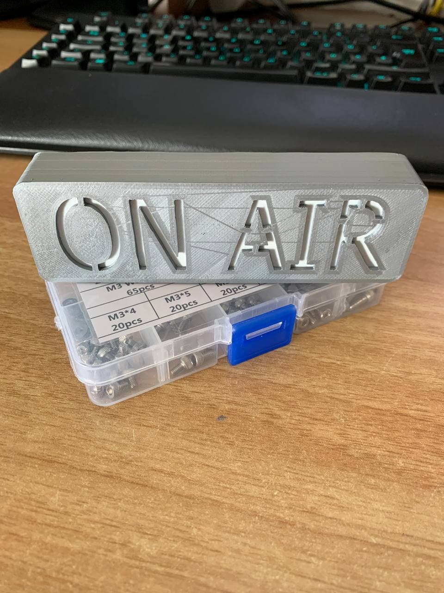
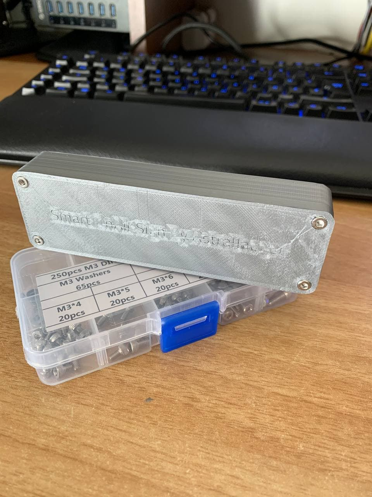

# Smart OnAir Sign

Do you know this issue, you are in a remote meeting and suddenly your roommate/significant other walks in and wants to talk to you?
I certainly do, thats why I designed this WiFi enabled on-air sign because I couldn't find one I liked.

The device operates rather simply: 
A web server runs on a Wemos D1 mini which hosts an mDNS enabled webserver with can be easily reached with the URL http://onairsign.local/. 
In order to manipulate the color the device displays the URL http://onairsign.local/color can be used with the following parameters:

| Parameter | Description                              | Example                              |
|-----------|------------------------------------------|--------------------------------------|
| **r**     | This parameter changes the red part of the displayed color. Values range from 0 to 255, whole numbers only. | http://onairsign.local/color?r=128   |
| **g**     | This parameter changes the green part of the displayed color. Values range from 0 to 255, whole numbers only. | http://onairsign.local/color?g=128   |
| **b**     | This parameter changes the blue part of the displayed color. Values range from 0 to 255, whole numbers only. | http://onairsign.local/color?b=128   |
| **lum**   | This parameter changes the brightness of the led's. Values range from 0 to 255, whole numbers only. | http://onairsign.local/color?lum=128 |
| **s**     | This is the status parameter. Values may be 0, 1 or 2. 0 displays a rainbow wave, 1 displays the set color, 2 turns the display off.  | http://onairsign.local/color?s=1     |

## Examples
- This sets the color to red at full brightness: 
http://onairsign.local/color?r=255&g=0&b=0&lum=255&s=1
- This disables the display: http://onairsign.local/color?s=2
- This shows a rainbow wave: http://onairsign.local/color?s=0

## Required tools
- 3D printer (obviously)
- Soldering iron
- Solder 
- Allen key

## BOM
- *1 x* **[LOLIN (WEMOS) D1 Mini](https://it.aliexpress.com/item/32529101036.html?spm=a2g0s.9042311.0.0.653f4c4dwwleCD)**
- *1 x* **[WS2812B 5V LED strip](https://it.aliexpress.com/item/2036819167.html?spm=a2g0s.9042311.0.0.653f4c4dAy9aew)**
- *4-6 x* **[M3x8 or M3x12 Screws](https://it.aliexpress.com/item/32846918173.html?spm=a2g0s.9042311.0.0.653f4c4dAy9aew)**
- *1 x* **3D printed top shell**
- *1 x* **3D printed bottom shell**
- *1 x* **3D printed light diffuser or sheet of paper** (optional)

## Printing instructions

## Assembly
### Step 1
Glue the diffuser in place, I used some Bostik superglue, but any glue that sticks to your material of choice will do. 
The diffuser may need some trimming in the corner.

### Step 2
Cut the LED strip into 3 or 4 pieces, connect them with some short wires (1 - 1.5cm or about 1/2"). 

### Step 3

## BOM Reference Pictures
- LOLIN D1 Mini

- ARGB LED Strip

- M3 Screws
