# Smart OnAir Sign
 This work is licensed under a <a rel="license" href="http://creativecommons.org/licenses/by-nc-sa/4.0/">Creative Commons Attribution-NonCommercial-ShareAlike 4.0 International License</a>.

Also available on Thingiverse: https://www.thingiverse.com/thing:4804813

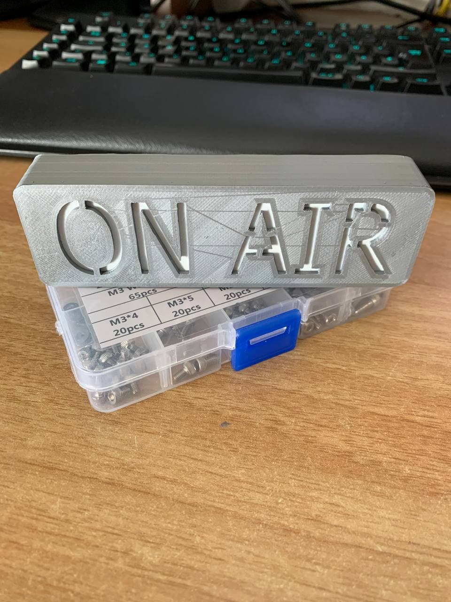
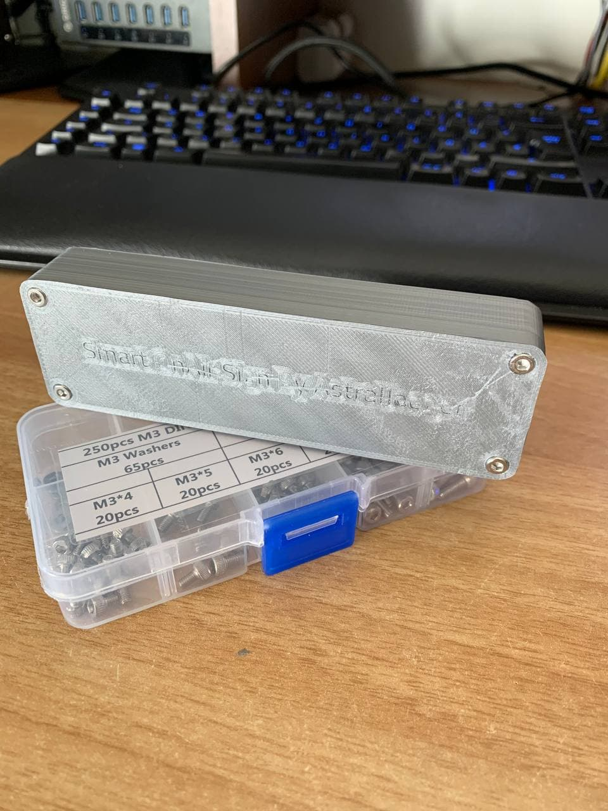

Do you know this issue, you are in a remote meeting and suddenly your roommate/significant other walks in and wants to talk to you?
I certainly do, that's why I designed this WiFi enabled on-air sign because I couldn't find one I liked.

The device operates rather simply: 
A web server runs on a Wemos D1 mini which hosts an mDNS enabled web server with can be easily reached with the URL http://onairsign.local/. 
In order to manipulate the color the device displays the URL http://onairsign.local/color can be used with the following parameters:

| Parameter | Description                              | Example                              |
|-----------|------------------------------------------|--------------------------------------|
| **r**     | This parameter changes the red part of the displayed color. Values range from 0 to 255, whole numbers only. | http://onairsign.local/color?r=128   |
| **g**     | This parameter changes the green part of the displayed color. Values range from 0 to 255, whole numbers only. | http://onairsign.local/color?g=128   |
| **b**     | This parameter changes the blue part of the displayed color. Values range from 0 to 255, whole numbers only. | http://onairsign.local/color?b=128   |
| **lum**   | This parameter changes the brightness of the led's. Values range from 0 to 255, whole numbers only. | http://onairsign.local/color?lum=128 |
| **s**     | This is the status parameter. Values may be 0, 1 or 2. 0 displays a rainbow wave, 1 displays the set color, 2 turns the display off.  | http://onairsign.local/color?s=1     |

## Examples
- This sets the color to red at full brightness: 
http://onairsign.local/color?r=255&g=0&b=0&lum=255&s=1
- This disables the display: http://onairsign.local/color?s=2
- This shows a rainbow wave: http://onairsign.local/color?s=0

## Required tools
- 3D printer (obviously)
- Soldering iron
- Solder 
- Allen key

## BOM
- *1 x* **[LOLIN (WEMOS) D1 Mini](https://it.aliexpress.com/item/32529101036.html?spm=a2g0s.9042311.0.0.653f4c4dwwleCD)**
- *1 x* **[WS2812B 5V LED strip](https://it.aliexpress.com/item/2036819167.html?spm=a2g0s.9042311.0.0.653f4c4dAy9aew)**
- *4-6 x* **[M3x8 or M3x12 Screws](https://it.aliexpress.com/item/32846918173.html?spm=a2g0s.9042311.0.0.653f4c4dAy9aew)**
- *1 x* **3D printed top shell**
- *1 x* **3D printed bottom shell**
- *1 x* **3D printed light diffuser or sheet of paper** (optional)

## Printing instructions
### Top shell
Avoid using a brim, turn the flat side with the text to the bottom. Do NOT drill out the screw holes, the screws should tap into this side.

### Diffuser
Print using 0.16 mm layer height, this way it will end up being 2 layers, print it in white filament. If you don't have white filament at hand, just cut out a sheet of paper or omit the whole thing, it just prevents you from seeing the electronics.

### Bottom shell
No brim should be necessary, if used, you'll have to clear out the screw holes. May need to drill out the screw holes, these are just through-holes on this side.

## Assembly
### Step 1
Glue the diffuser in place, I used some Bostik superglue, but any glue that sticks to your material of choice will do. 
The diffuser may need some trimming in the corner.

### Step 2
Cut the LED strip into 3 or 4 pieces, connect them with some short wires (1 - 1.5cm or about 1/2"). 
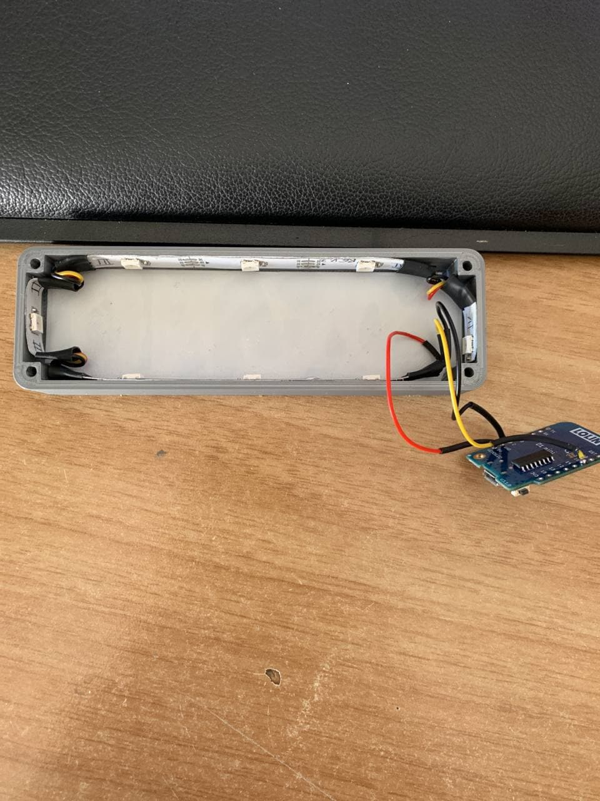

### Step 3
Solder a slightly longer piece of wire to the beginning of your LED strip and to the bottom (The top is the side with the USB port) of your Wemos, 5V goes to 5V, GND to GND and DIn to GPIO16 or D0 of the board.
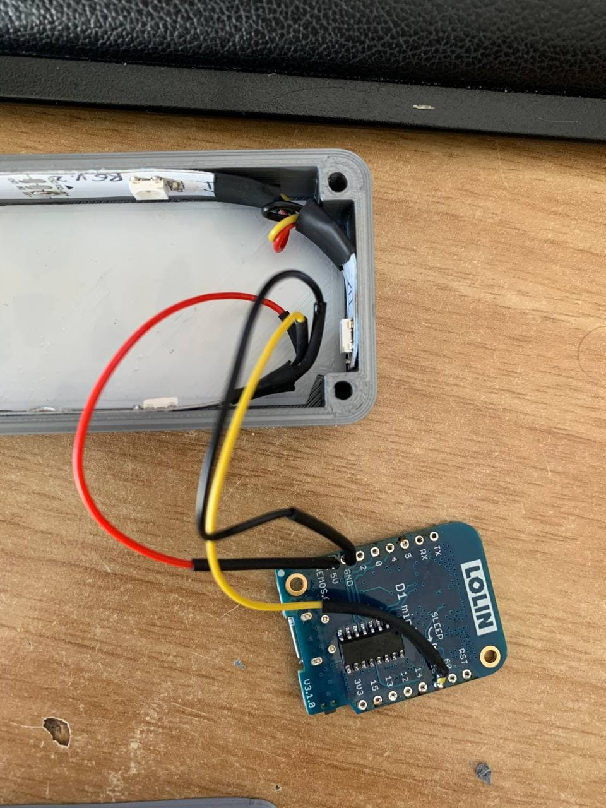

### Step 4
Push the Wemos into its slot on the bottom shell, usb port should point down, it should be a tight fit and stay in-place without any glue. 
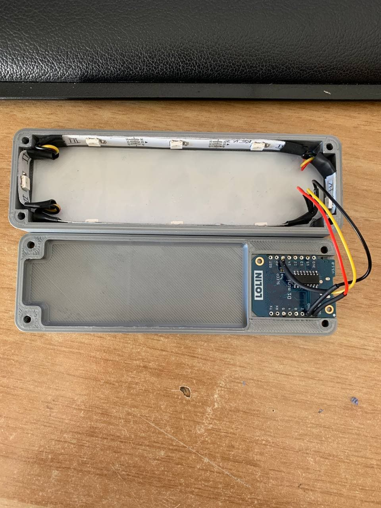

### Step 5
Before closing your Project, make sure to upload the code available [here](/blob/master/Code/ESP/ESP8622_Code) using the Arduino IDE or PlatformIO or VisualMicro. **Make sure to enter your WiFi ssid and password in the code!** 
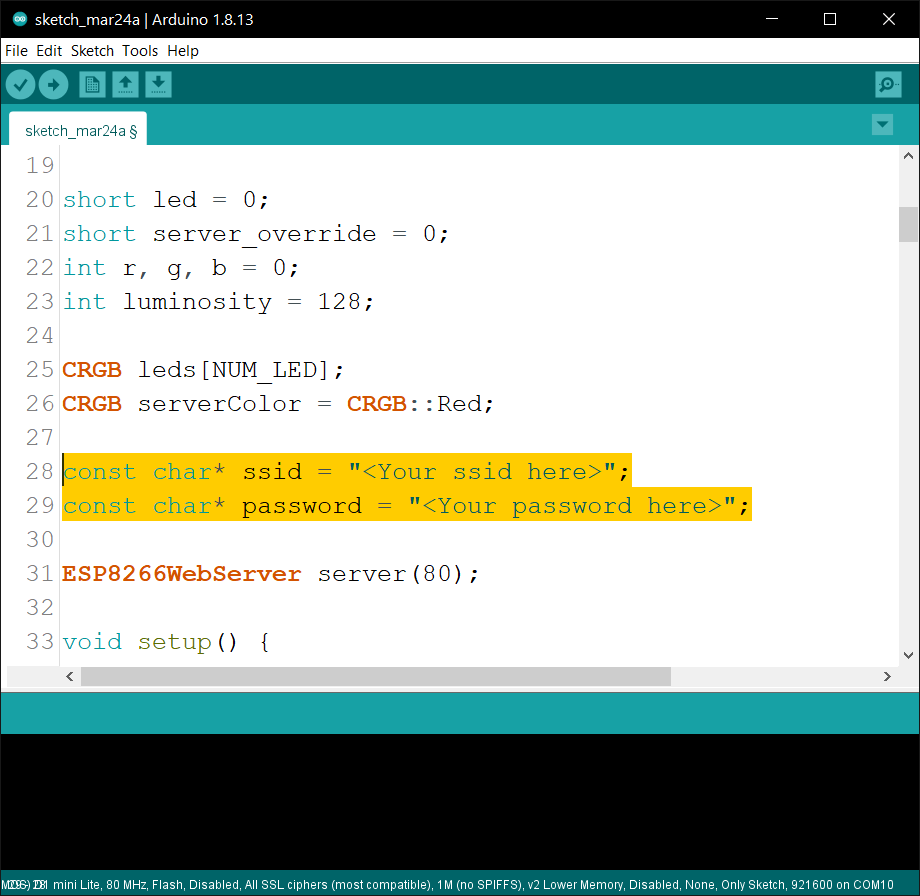

In order to get the correct device to upload your code you may need to add this ``https://arduino.esp8266.com/stable/package_esp8266com_index.json`` to your Preferences -> Additional Boardmanager URL's.
Then download the necessary files using the board manager.
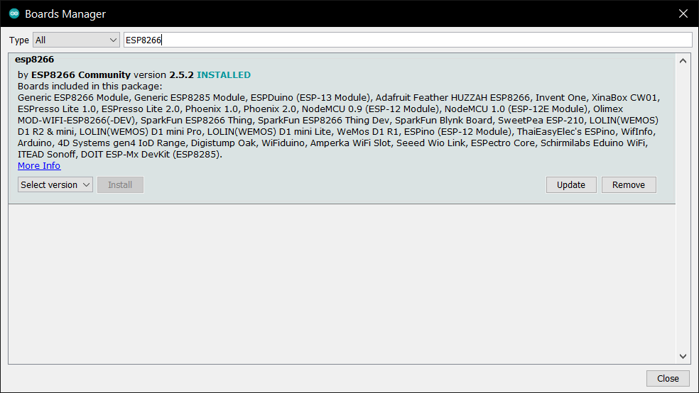

After uploading, open the Serial Monitor and wait for the device to start up. There is a 2 second startup sanity delay as recommended by the FastLED library.
Wait until your serial monitor output looks similar to this: 
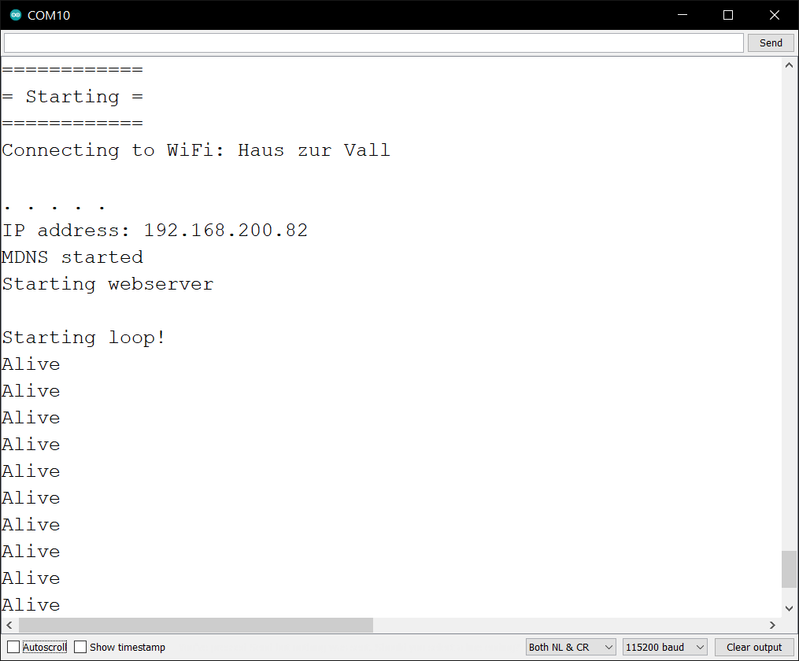

### Step 6
Now when your LED's light up, you can close the case and enjoy your new On Air sign!

## BOM Reference Pictures
- LOLIN D1 Mini
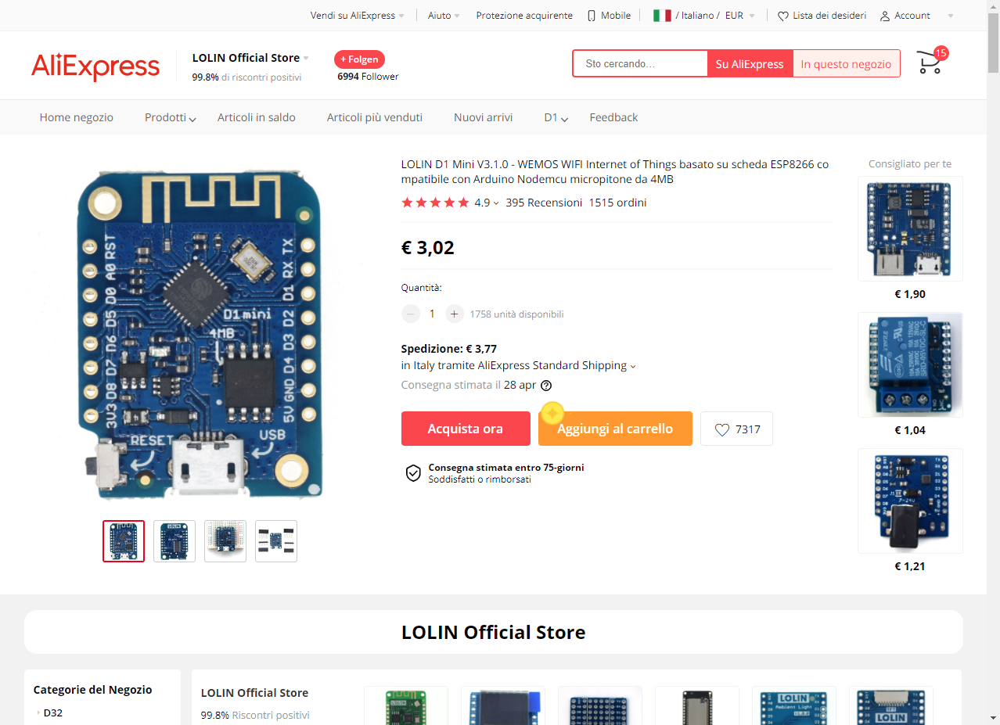
- ARGB LED Strip
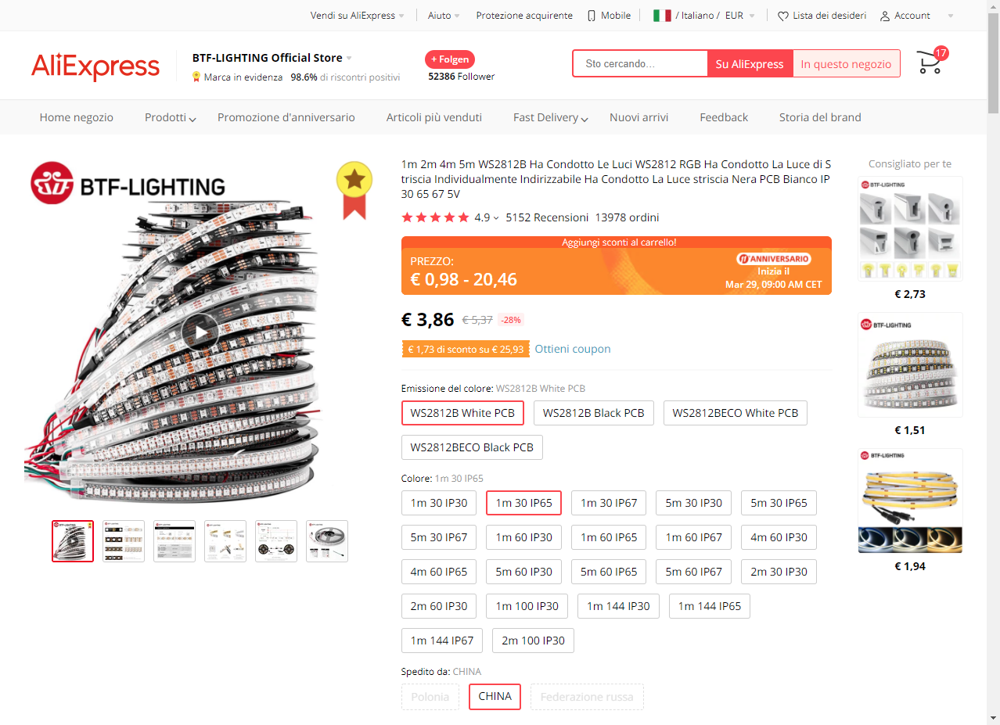
- M3 Screws
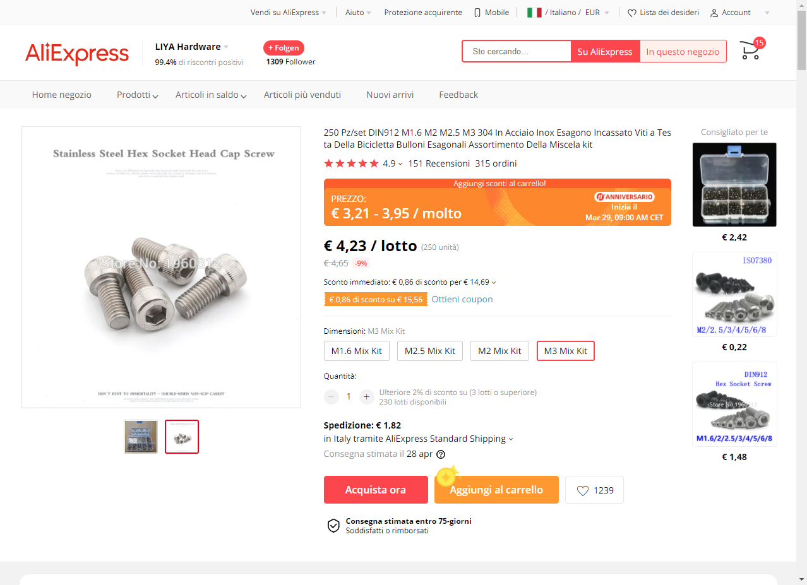

## Planned updates
- Python program to monitor Discord, Zoom and Twitch for activity and enable the sign automatically
- Bottom shell with various mounting options
- RaspberryPi Zero instead of ESP

## Updates
24.03.2021 - Create first version
